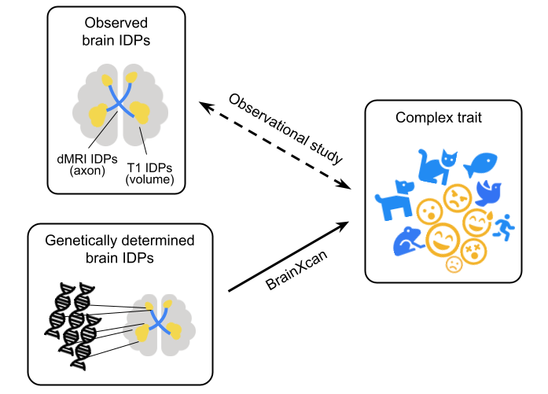

# What is brainxcan testing?

BrainXcan explores the association between a complex phenotype and a collection of brain phenotypes quantified by MRI. Since these brain phenotypes are derived from image, we call them IDPs (image-derived phenotypes). In typical observation study, this is done by associating complex trait with observed brain IDPs. 

But in BrainXcan, we consider using a study cohort from which we have both genotype and phenotype information (any GWAS cohort meets these requirements). First, we impute brain IDPs from the genotype (this is the so called genetically determined brain IDPs). And second, we associate the imputed brain IDPs with the phenotype. 

It turns out that BrainXcan analysis can be performed using GWAS summary statistics without touching the individual-level data of the study cohort. BrainXcan software takes user-specified GWAS summary statistics as input and it performs:

1. Summary-based BrainXcan (S-BrainXcan) which returns the association between brain IDP and the phenotype; 
2. Mendelian randomization (MR) between the significant IDP and the phenotype to provide additional evidence of the causal flow (IDP <-?-> phenotype).

Please refer to [BrainXcan paper](to_be_filled) for more details.

# What is brainxcan software doing?

BrainXcan software is implemented as a light-weight data pipeline written with [snakemake](https://snakemake.readthedocs.io/en/stable/). In below is shown the workflow.

* `sbxcan_t1` and `sbxcan_dmri` run S-BrainXcan for all of the structural IDPs (T1 IDPs) and diffusion IDPs (dMRI IDPs) respectively.
* `sbxcan_merge` aggregates the results from both structural and diffusion IDPs into one file.
* `sbxcan_vis` visualizes the S-BrainXcan z-scores spatially.
* `mr` runs MR for each significant IDPs (top 10 IDPs by default).
* `mr_vis` visualizes and summarize the MR analysis for each significant IDP.
* `sbxcan_report` summarizes all these results above into an automated report.

In brief, a full S-BrainXcan run will contain the following outputs:

1. Association results in figure and table of all IDPs.
2. MR results in figure and table for each of the significant IDPs.
3. An automated report.

# How to use BrainXcan software?

Please refer to "[Get started with an example](example.html)".

